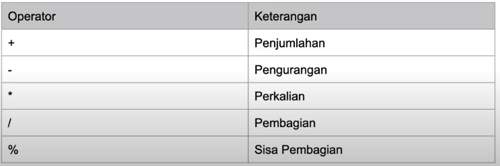

# go-learning

## operasi matematika

- operasi matematika sama seperti penggunaan di bahasa lain
  
- selain itu ada operasi lain yaitu augmented assignments
  
- selanjutnya ada juga unary operator
  
