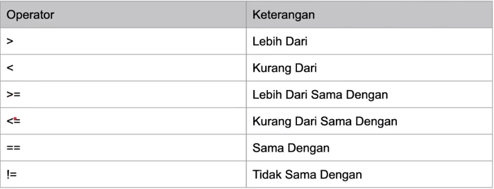

# go-learning

## operasi perbandingan

- operasi perbandingan adalah operasi untuk membandingkan dua buah data
- operasi perbandingan adalah operasi yang menghasilkan nilai boolean(true/false)
- jika opersinya benar nilainya true dan sebaliknya
  
