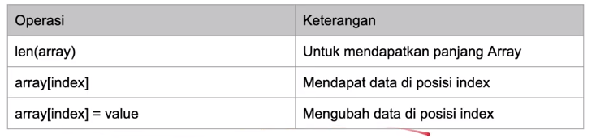

# go-learning

## tipe data array

- array adalah tipe data yang berisikan kumpulan data dengan tipe data yang sama
- saat membuat array, kita perlu menentukan jumlah data yang bisa ditampung oleh array tersebt
- daya tampung array tidak bisa bertambah setelah array dibuat
- untuk mengakses array kita bisa menggunakan index, index di array dimulai dari 0
- function array
  
